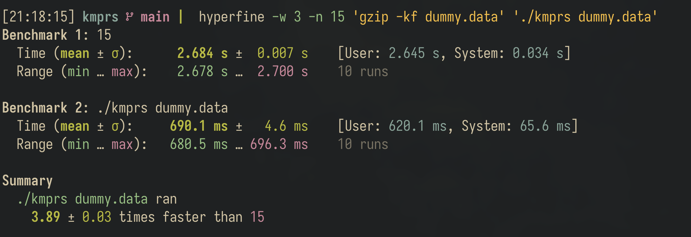
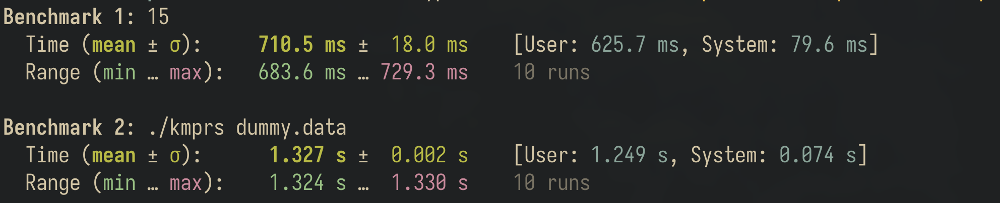

# kmprs - A Shannon-Fano File Compression Tool

`kmprs` is an educational command-line file compression utility built to explore entropy encoding and prefix tree algorithms using Shannon-Fano coding.

> [!NOTE]
> `kmprs` is designed for learning and experimentation with statistical encoding algorithms.

---

## Installation

### Option 1: Quick Install (curl)

Run the automated installer to detect your platform, download the latest pre-compiled release, and install `kmprs`:

```bash
curl -fsSL https://raw.githubusercontent.com/shadowmkj/kmprs/main/install.sh | bash
```

### Option 2: Pre-built Binaries (Manual)

Download the latest pre-compiled archive for your platform (Linux x86_64 or macOS Apple Silicon) from the [GitHub Releases](https://github.com/shadowmkj/kmprs/releases) page:

```bash
# Extract the archive
tar -xzf kmprs-v*-*.tar.gz

# Move binary into your PATH
sudo mv kmprs /usr/local/bin/
```

### Option 3: Build from Source

#### Prerequisites
- A C11-compliant compiler (`gcc` or `clang`)
- [Just](https://github.com/casey/just) task runner (optional, but recommended)

#### Build Steps
```bash
# Clone the repository
git clone https://github.com/shadowmkj/kmprs.git
cd kmprs

# Build optimized release binary
just build-release

# (Alternative without Just)
gcc -Wall -Wextra -Werror -pedantic -std=c11 -O3 -DNDEBUG \
  main.c helper.c core.c shannon.c bit_io.c format.c codec.c -o kmprs

# Optional: Install binary to /usr/local/bin
sudo cp kmprs /usr/local/bin/
```

---

## Usage

### Compression

Compress any file into a `.shn` container:

```bash
# Default output creates <input_file>.shn
kmprs document.txt

# Specify custom output path
kmprs document.txt compressed_archive.shn
```

### Decompression

Decompress a `.shn` container using the `-d` flag:

```bash
# Automatically strips .shn extension (restores document.txt)
kmprs -d document.txt.shn

# Specify custom output destination
kmprs -d compressed_archive.shn restored_document.txt
```

---

## Performance & Benchmarks

### Compression Speed vs. Gzip

Benchmarked against standard `gzip` on a 100 MB test payload (`dummy.data`) using [`hyperfine`](https://github.com/sharkdp/hyperfine):



| Command | Mean Execution Time | User Time | System Time | Relative Speed |
| :--- | :--- | :--- | :--- | :--- |
| **`kmprs dummy.data`** | **690.1 ms ± 4.6 ms** | **620.1 ms** | 65.6 ms | **3.89 ± 0.03x faster** |
| `gzip -kf dummy.data` | 2.684 s ± 0.007 s | 2.645 s | 34.0 ms | 1.00x (baseline) |


> [!TIP]
> `kmprs` leverages an inlined two-tier block-buffered bit reservoir (4 KiB chunking) and direct array codebook lookups, eliminating per-byte syscalls, libc stream locking, and CPU branch mispredictions.

### BitWriter I/O Buffering Impact

Initially, `BitWriter` emitted each 8-bit byte immediately using `fputc()`. On large payloads (e.g. 100 MB files), this incurred ~100 million function calls and repeated libc stream locking operations.

To eliminate this bottleneck, we introduced a two-tier buffered architecture:
1. **64-bit Bit Accumulator**: Handles sub-byte bit packing in registers using fast bitwise shifts and masks.
2. **4 KiB Block Buffer**: Batches full bytes into a 4,096-byte array before performing bulk `fwrite()` transfers.
3. **Inlined Emission (`bit_writer_write`)**: Inlined directly into the compression loop in `bit_io.h` to eliminate per-symbol call overhead.



| Implementation | Mean Execution Time | User CPU Time | System Time | Impact |
| :--- | :--- | :--- | :--- | :--- |
| **Buffered BitWriter (4 KiB buffer + inline)** | **710.5 ms ± 18.0 ms** | **625.7 ms** | 79.6 ms | **~1.87x faster (2.0x CPU time reduction)** |
| Unbuffered BitWriter (per-byte `fputc`) | 1.327 s ± 0.002 s | 1.249 s | 74.0 ms | Baseline |

### Compression Ratio & Size Comparison

On the 100 MB test dataset (`dummy.data`), `kmprs` achieves competitive output size due to heavily skewed character frequency distributions:

| Format / Tool | Original Size | Compressed Size | Space Savings |
| :--- | :--- | :--- | :--- |
| **`kmprs` (Shannon-Fano)** | 104.86 MB (104,857,601 B) | **53.25 MB (53,247,590 B)** | **49.2%** |
| `gzip` (Deflate / LZ77 + Huffman) | 104.86 MB (104,857,601 B) | 59.72 MB (59,715,619 B) | 43.0% |

> [!WARNING]
> **Dataset & Algorithmic Limitations:**
> - **Limited File Testing**: This comparison was tested on specific test datasets and has not been exhaustively evaluated across diverse real-world file corpora (e.g. source code trees, rich prose, JSON/XML, multimedia, or binary executables).
> - **Where Gzip Compresses Better**: `gzip` uses DEFLATE (LZ77 sliding-window dictionary matching combined with Huffman coding). On typical real-world text, source code, and structured data with repeated phrases and substrings, `gzip` will compress significantly better than `kmprs` because LZ77 replaces entire multi-byte sequences with compact back-references.
> - **Shannon-Fano Suboptimality**: `kmprs` implements pure order-0 Shannon-Fano coding (top-down recursive splitting). Theoretically, Shannon-Fano is a greedy heuristic that does not guarantee minimal expected code length, making it mathematically suboptimal compared to Huffman coding. Additionally, tiny files (< 2 KiB) may experience container overhead due to the uncompressed symbol table header.

---

## Testing & Verification

```bash
# Run unit tests and CLI roundtrip verification
just test

# Run tests under AddressSanitizer and UndefinedBehaviorSanitizer
just test-asan

# Run clang-tidy static analysis
just tidy
```

